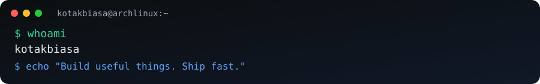

<div align="center">
  

# 👋 Halo, I'm **Kotak Biasa**
### `Builder • Automation Enthusiast • Open Source Explorer`

[](https://github.com/kotakbiasa)
[](https://github.com/kotakbiasa?tab=followers)
[](https://github.com/kotakbiasa?tab=repositories)
[](https://archlinux.org)
</div>

---

```console
╭─kotakbiasa@archlinux ~
╰─$ fastfetch
OS      : Arch Linux x86_64
Shell   : zsh / bash
Focus   : Bots • Automation • VPS • Open Source
Motto   : Build useful things. Ship fast.
```

## 🚀 About Me
- 🇮🇩 Based in Indonesia
- 🤖 Building bots, control panels, and automation tools
- 🐧 Daily OS: **Arch Linux** (`btw` 😼)
- ⚡ Practical projects, clean workflow, quick deployment

## 🧰 Tech Stack
<div>
  
  
  
  
  
  
  
</div>

## 🧩 Featured Repositories
<div align="center">
  <a href="https://github.com/kotakbiasa/control-bot"></a>
  <a href="https://github.com/kotakbiasa/dramabot"></a>
</div>
<div align="center">
  <a href="https://github.com/kotakbiasa/ThinkPad-X380-Yoga-Hackintosh"></a>
  <a href="https://github.com/kotakbiasa/tg-gemini-bot"></a>
</div>

## 📊 GitHub Stats
<div align="center">
  
  
</div>

<div align="center">
  
</div>

## 🐍 Contribution Snake
<div align="center">
  
</div>

## 📬 Contact
<div align="center">

[](https://t.me/PleaseNoPM)
[](https://t.me/AntiSpamID)
[](https://t.me/KotakBiasa)
[](https://github.com/kotakbiasa)

</div>

---

<div align="center">
  <i>"Build useful things. Keep it simple. Ship it."</i>
</div>
